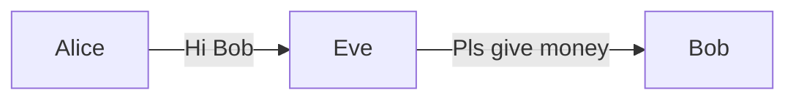

## Sicherheitsprobleme

und wie man sie behebt.

---
### Nachrichtenaustausch

(A)lice schickt eine Nachricht an (B)ob.

(E)ve versucht die Nachricht abzuhören und zu verändern.

---
### Sicherheitsprobleme beim Austausch

Es gibt folgende Probleme bei diesem Austausch:

* Eve sollte die Nachricht nicht mitlesen können (Vertaulichkeit)
* Eve sollte die Nachricht nicht verändern können (Integriät)
* Bob sollte sicher sein, dass Nachricht von Alice stimmt (Authentizität)
* Alice sollte nicht abstreiten könne, dass Nachricht von ihr ist (Verbindlichkeit)

---
### Sicherheitsziele

Daraus leiten sich diese Ziele ab:

* **Vertraulichkeit** 😈: Die Nachricht, die man erhält, ist nicht von dritten Personen gelesen worden.
* **Integrität** 💎: Die Nachricht, die man erhält, ist von keiner dritten Person manipuliert worden.
* **Authentizität** 🙋‍: Die Nachricht, die man erhält, stammt wirklich von der Person, die als Absender angegeben ist.
* **Verbindlichkeit** 📝: Der Urheber kann nachträglich nicht bestreiten, die Nachricht verfasst zu haben.

---
### Massnahmen im Alltag

Im Alltag wenden wir das bereits an.

* Nachricht End-to-End-verschlüsseln (Vertraulichkeit)
* Nachricht in Umschlag stecken (Integrität)
* Unterschrift machen (Authentizität, Verbindlichkeit)

---
### Massnahmen im Rechenzetrum

Dieselben Sicherheitsziele lassen sich für Rechnernetze realisieren.

* Moderne Verschlüsselung (Vertraulichkeit)
* Digitale Signatur (Integrität, Authentitzität, Verbindlichkeit)

---
### Nächstes Kapitel

Weiter geht es mit [Geschichte der Kryptografie](slides1.md)