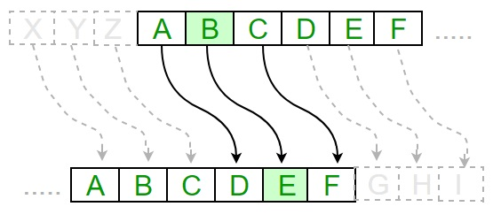

## Geschichte der Kryptografie

und ein paar neue Begriffe.

---
### Alltäglich

> Wir begenen Krypographie jeden Tag.

* Zahlung Kreditkarte 💳
* Verluste beim Bitcoin-Traden 📉
* Mit Wifi verbinden 📶

---
### Bei der Arbeit umso wichtiger

> Digitale Informationen müssen geschützt werden.

* Patientendaten im Spital 🏥
* Login-Informationen im Browser 🔓
* Zugang zu Geräten 💻

---
### Viele Fragen

* Wie funktioniert Kryptografie?
* Warum ist Kryptografie wichtig?
* Welche Arten von Kryptografie werden heute verwendet?
* Wie wird Kryptografie in der Sicherheit eingesetzt?
* Wie kann Kryptografie von durchschnittlichen Benutzern verwendet werden?

---
### Funktionsweise

---
### Begriffe

**Verschlüsselung** 🔒: Herstellung von Klartext (lesbare) Nachricht in eine Geheimtext (nicht lesbare) Nachricht

**Entschlüsselung** 🔓: Verwendung eines geheimen Schlüssels zur Entschlüsselung eines Geheimtext

**Chiffre** 🛡️: Verwendeter Algorithmus zur Verschlüsselung und Entschlüsselung einer Nachricht

---
### Vor dem Computer

* 1500 v. Chr. Tontafeln aus Mesopotamien weisen Anzeichen von Verschlüsselung auf
* 500 bis 600 v. Chr. verwenden hebräeische Gelehrte eine alphabetische Substitutionschiffre (A = Y, B = W, C = G usw.)

---
### In Kriegszeiten besonders gefragt

* Im 18. Jahrundert verwenden britische Streitkräfte Formen der Krypographie zur Kommunikation zwischen Generälen
* Im Zweiten Weltkrieg wurden mechanische und elektromechanische Chiffriermaschinen eingesetzt (Enigma-Maschine)
* Alan Turing hat unter anderem Techniken entwickelt um deutsche Chiffren zu brechen

---
### Krypto-Begriffe

Hat nichts mit Bitcoin zu tun.

**Kryptographie**: Wissenschaft der Datensicherung

**Kryptoanalyse**: Wissenschaft der Analyse und Entschlüsselung von verschlüsselter Daten

**Kryptologie**: Umfasst Krtypographie und Kryptoanalyse

---
### Wie funktioniert Krypographie?

Die symmetrische Verschlüsselung:

ℹ️  Der gleiche Schlüssel wird für Ver- und Entschlüsselung verwendet

---
### Ein Beispiel mit Cäsar

Einfaches Beisiel einer Ersetzungsschiffre.

Die Position der Buchstaben wird verschoben.

---
### Cäsar mit Python

<iframe src="https://trinket.io/embed/python3/50ceaaf323" width="100%" height="356" frameborder="0" marginwidth="0" marginheight="0" allowfullscreen></iframe>

---
### Stärken und Schwächen

der symmetrischen Verschlüsselung:

➕ Ver- und Entschlüssel ist sehr schnell
➖ Nicht geeignet für Daten, die übertragen werden

* Der Sender und Empfänger müssen den Schlüssel kennen -> Austausch über separaten Kanal -> Gefahr von Mitlesern
* Geeignet für Verschlüsselung von lokaler Datenbank, Festplatte oder Daten auf Smartphone

---
### Brute-Force Attacke

Die Cäsar-Verschlüsselung kann relativ einfach geknackt werden:

<iframe src="https://trinket.io/embed/python3/2805b9db5b" width="100%" height="356" frameborder="0" marginwidth="0" marginheight="0" allowfullscreen></iframe>

ℹ️ Bei Brute-Force Attacke werden zufällige Schlüssel generiert und ausprobiert.

---
### Sicherheit

Verschlüsselungsverfahren geheim gehalten oder veröffentlichen?

ℹ️ "security by obscurity" hat sich als untauglich erwiesen

Die Lösung ...

---
### Das von Prinzip von Kerckhoffs

* Prinzip zur Entwicklung von Chiffrierverfahren
* Entwickelt vom niederländischen Kryptologen Kerckhooffs

> Die Sicherheit eines Chiffriersystems darf nicht davon abhängen, ob das benutzte Verfahren zum Ver- und Entschlüsseln bekannt ist. Die Sicherheit soll nur auf der Geheimhaltung von Schlüsseln beruhen.

---
### Gute kryptografische Verfahren

erfüllen heute in der Regel diese Kriterien:

-   Sie beruhen auf dem Kerckhoffs-Prinzip
-   Sie werden von Kryptologen (bzw. -analytikern) weltweit untersucht
-   Sie durchlaufen erfolgreich alle möglichen Angriffszenarien.

---
### Als Nächstes

Weiter geht es mit [Bausteine der Kryptographie](slides2.md).