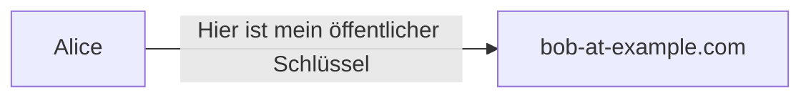
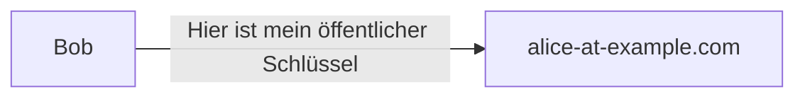

## Übungen

zu [Thema 1 - Einführung in die Kryptographie](README.md).

### Aufgabe 1 - Der Algorithmus in Farbe

Schauen Sie sich den [Diffie-Hellman-Schlüsselaustausch mit Farben an](https://www.inf-schule.de/kryptologie/modernechiffriersysteme/exkurs_diffie). Verändern Sie die Inputs und versuchen Sie den Vorgang zu verstehen.

War das zu einfach, versuchen Sie den Algorithmus selber nachzurechnen.

### Aufgabe 2 - Elektronische Unterschrift

In dieser Aufgabe möchten wir eine PDF-Datei elektronisch signieren und die Unterschrift von ein anderen Person verifizieren.

#### Vorbereitung

Installieren Sie als erstes eine GnuPG-Schlüsselverwaltungssoftware: [Kleopatra](https://www.openpgp.org/software/kleopatra/)\
Alternativ geht auch: [Gpg4win](https://www.gpg4win.org/)

Bevorn Sie die Software wie folgt vor.

* Erstellen Sie ein Schlüsselpaar (dazu ein Beispiel)

Name: `Alice Example`\
Mail: `alice@example.com`\
Key size: `2048`\
Algorithm: `RSA & RSA`

* Setzen Sie ein Passwort für den privaten Schlüssel


#### Ablauf

Sie erhalten einen Vertrag als PDF-Datei, eine Unterschrift-Datei sowie einen dazugehörgien Public Key von [Adobe](https://www.adobe.com/).

Das Sie dem Absender vertrauen nehmen Sie den Public Key in ihren Schlüsselbund auf.

Der Vertrag wurde von Adobe unterschrieben. Sie verfizieren die Unterschrift und stellen sicher, dass der Vertrag nicht verändert wurde.

Anschliessend unterschreiben Sie den Vertrag mit ihrem eigenen Schlüssel.

#### Durchführung

* Laden Sie die PDF-Datei herunter: [Acme-NDA.pdf](https://github.com/janikvonrotz/encrypt.casa/raw/main/Acme-NDA.pdf)
* Und die Unterschrift-Datei: [Acme-NDA.pdf.sig](https://github.com/janikvonrotz/encrypt.casa/raw/main/Acme-NDA.pdf.sig)


* Versuchen Sie die PDF-Datei zu verfizieren. Es sollte ohne Public Key nicht möglich sein.


* Laden Sie den Public Key herunter: [Adobe-Public-Key.asc](https://github.com/janikvonrotz/encrypt.casa/raw/main/Adobe-Public-Key.asc)


* Importieren Sie den Public Key in ihren Schlüsselbund
* Verifizieren Sie die PDF-Datei erneut.


* Signieren Sie den importierten Schlüssels und verifizieren Sie die PDF-Datei erneut.


* Signieren Sie die PDF-Datei mit ihrem eigenen Schlüssel.

### Aufgabe 3 - Verschlüsselte E-Mails

In dieser Übung möchten wir mit GnuPG verschlüsselte und signierte E-Mails austauschen.

#### Vorbereitung

* Öffnen Sie Software für die Schlüsselverwaltung.

* Exportieren Sie den öffentlichen Schlüssel in ein Notepad. Hier ein Beispiel:

**example.asc**

```
-----BEGIN PGP PUBLIC KEY BLOCK-----

mQENBGCl+ncBCAC76XE5mzoD3A2Zi8yubYf9MezIVQk3MkiZtsL20bzzWNf5Dmt2
Sp0ZWPPozS91ERRe2KJgA9FJIzLGClMBPtRmx57tvzCZ7odHx60BKVol/R0ICd1C
lfCruItGbOqcB4r93DKLuTJBBVaxe5uS7U27HNi8gSuf2xnx4y7eO5CHJRna59bi

...

xTAF7qS+fUk2Kcvl0r+yKFCwtDReDo4fN0KhBf6Ef5qNIazwoPie4JS6AY08OpaA
Gm8mBS9lnn+Y+PThZN/PcWACaQGR4g+p1xDufyrgtUPpGEKiueybeWkgw1pIpCeJ
gKMMy+KwcP8JBxJDCExsUt3fzWxtsbaYiRmN5lWRreuKgpzCUR86/IjrusXziJ8L
J6d0
=c7Rj
-----END PGP PUBLIC KEY BLOCK-----
```

* Öffnen Sie ihr E-Mail-Programm und teilen Sie ihre E-Mail-Adressen dem Nachbarn mit.

#### Ablauf

Hier folgt nun ein Ablauf, den wir anschliessend mit dem E-Mail-Programm und Schlüsselverwaltung durchführen möchten.

Wir haben zwei Teilnehmer `alice@example.com` und `bob@example.com`.



Bob vertraut dem Absender und nimmt den öffentlichen Schlüssel von Alice in seinen Schlüsselbund auf.

Bob verschlüsselt seinen öffentlichen Schlüssel mit dem öffentlichen Schlüssel von Alice und sendet diesen an Alice.



Alice entschlüsselt den öffentlichen Schlüssel von Bob und nimmt diesen in den Schlüsselbund auf.

ℹ️ Der öffentliche Schlüssel kann auch unverschlüssel übertragen werden.

Nun kann Alice irgendeine Nachricht mit dem öffentlichen Schlüssel von Bob verschlüsseln und schicken. Ausschliesslich Bob kann die Nachricht entschlüsseln und lesen.

#### Durchführung

🎬 Führen Sie Ablauf  nun selber durch. Falls Sie niemanden zum anschreiben haben, versuchen Sie es mit <adele@gnupp.de>. Das ist ein Bot und sollte den geschilderten Ablauf unterstützen.

🎬 Führen Sie Ablauf nochmals durch, jedoch signieren Sie die Nachricht, statt Sie zu verschlüsseln.

### Aufgabe 4 - Sniffing mit Wireshark

Für diese Aufgabe brauchen wir [Wireshark](https://www.wireshark.org/download.html).

Mit Wireshark kann man im verbunden Netzwerk die übertragenenen Pakete mitlesen. Natürlich nur so fern die unverschlüsselt sind.

Installieren Sie das Programm und starten Sie einen *Capture.*

Der Dozent wird auf seinem Linux-Gerät einen UDP-Server starten

`nc -luk 12101`

Anschliessend wird die Dozentin eine UDP-Nachricht verschicken.

`echo -n "some dark secret" | nc -u -b 255.255.255.255 12101`

Können Sie die Nachricht mitlesen? Um die Nachricht besser zu filtern können Sie diesen Filter verwenden:

`udp.port == 12101`