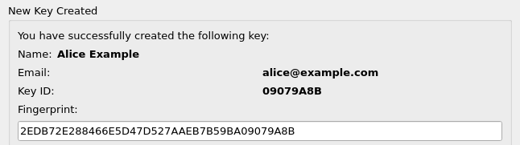
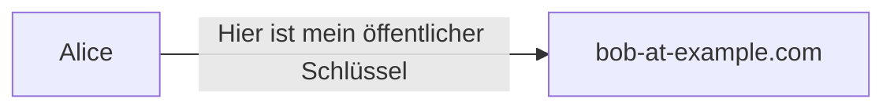
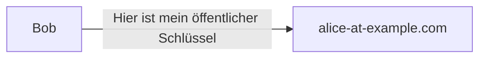

## Übungen

zu [Einführung in die Kryptographie](README.md).

### Aufgabe 1 - Der Algorithmus in Farbe

Schauen sie sich den [Diffie-Hellman-Schlüsselaustausch mit Farben an](https://www.inf-schule.de/kommunikation/kryptologie/modernechiffriersysteme/exkurs_diffie). Verändern sie die Inputs und versuchen sie den Vorgang zu verstehen.

War das zu einfach, versuchen sie den Algorithmus in Zahlen selber nachzurechnen.

### Aufgabe 2 - Verschlüsselte E-Mails

In dieser Übung möchten wir mit GnuPG verschlüsselte und signierte E-Mails austauschen.

Installieren sie als erstes eine GnuPG-Schlüsselverwaltungssoftware:

Windows: [Gpg4win](https://www.gpg4win.org/)\
Linux: [KGpg](https://utils.kde.org/projects/kgpg/)

Und bereiten sie die Software vor.

#### Vorbereitung

Bevor wir unsere Schlüssel austauschen können, müssen wir welche haben.

* Erstellen sie ein Schlüsselpaar (dazu ein Beispiel)

Name: `Alice Example`\
Mail: `alice@example.com`\
Key size: `2048`\
Algorithm: `RSA & RSA`

* Setzen sie ein Passwort für den privaten Schlüssel



* Exportieren sie den öffentlichen Schlüssel in ein Notepad

```
-----BEGIN PGP PUBLIC KEY BLOCK-----

mQENBGCl+ncBCAC76XE5mzoD3A2Zi8yubYf9MezIVQk3MkiZtsL20bzzWNf5Dmt2
Sp0ZWPPozS91ERRe2KJgA9FJIzLGClMBPtRmx57tvzCZ7odHx60BKVol/R0ICd1C
lfCruItGbOqcB4r93DKLuTJBBVaxe5uS7U27HNi8gSuf2xnx4y7eO5CHJRna59bi
VTrb0xD5JepJ90wgjD7ly9tKoWtyCR6Jbq6x1gVIgcjNF98f6V0ClUzFOBwMvb+z
Ohlw7v2EeDyFoFZkBOLyJiw5u4+VU27WB1Hwd+iSLvbJ/Ht56IkwKmNYYSsUTX7H
Wgl9e6MyaoQOPQyYAnyM2ensiTtfxCguCIblABEBAAG0IUFsaWNlIEV4YW1wbGUg
PGFsaWNlQGV4YW1wbGUuY29tPokBTgQTAQoAOBYhBC7bcuKIRm5dR9Unqut7WboJ
B5qLBQJgpfp3AhsvBQsJCAcCBhUKCQgLAgQWAgMBAh4BAheAAAoJEOt7WboJB5qL
MIAIAIyuF0uR3rtpDeosee9IECdTb4EZBdQ+GSI1iGUb/6CpZvdf9oaKKE9yO7Hg
Zc4LE69YQqP922a9ssJJavYksRCKn/B8R83LoE4M9b+M8turdEtqH2Mtbl3ivEBx
DKkybCE/fwlRQ8J5iFOFgUXRS/RzgmkKjubgedzjRU0fDVUXy92heX25bsvQtz3B
tuQ5Ed5/iFOsU8GEhPt3bGunhuVI3HmYglLbJtt3dFADRpaSWN0afpUKxLVzGo+s
qoMI7AX9ypQW9MO1a8x36loO20GGxNcmVah1H12h7m7JCvPlwnvjutjS58XieCuE
GuPvZJrSF3gtslwvGaSCjJwBany5AQ0EYKX6dwEIAKgSXQdK1IOMfO+bIsFZjgYG
iNtqOqWThktZ6xLsPFOWuIgIiwXBFKxlel0U1mWyXCcwLEcGzVLkirngqZLBSr7m
X5XG0eaPRUkUeSVemdgFsjOm8VXXS8KMNVrsZ1MFZ4zbIBJ1eSRIlBkJWGom8N+9
zQ9V5oW6yYLtodvZpeCHrEgaS/Okh4AaSEG5P1stf6e5MpoRa0tZ4Uj1a0IusbCS
oapKwZ9fUKYh+YImnYfOVynGAqtnvxUkDX6m38bRFBhzLWPgcIe+k47gwuh9skuC
MU8YaVSoWMhswOoDIW9ZaZuXbw1PNoEqVcPnuotXCpy9benq6yPjuAfscVRFKjMA
EQEAAYkCbAQYAQoAIBYhBC7bcuKIRm5dR9Unqut7WboJB5qLBQJgpfp3AhsuAUAJ
EOt7WboJB5qLwHQgBBkBCgAdFiEEld1cqurzrS6a1fHhon1gj7+q2KQFAmCl+ncA
CgkQon1gj7+q2KQqKQf6A5z7WyhG4sAp91IFVs0xMlNuW8TlWNSC9seCnflzJwoS
Hvm6ROB9qj/VX1J2GMFPf22rmaFeJFegnQ1qJpRGr105oRZk0MV0drB+2CT2aTKK
6k0Gosk7PGdmQw9TXFD6S6cIhk8DYgpcJfUcEgGzqUZiuYuCA6Cs2jqROfCXJdct
6aQn/L1s17ontW2VGevL1XEUQwSYaWJQ3itSG+p5fLNF6h9TdQ8pNt+rt1xinhQN
P2yIAEl87Ab6m4Z8Dw5guGN5R6izngHrwu1RKXt5k1HTluZqKtqzfQ5j+12GTcuF
b+5kzHdtzsHTFtUxzL/60bXiGcB7zuj1MuzInEeSSf3WB/9QsiOetMk8Kj5O7KmK
s+cBAPH0z9pUV888gXN4vIkarxzv9aCpUrrS8tRWFDMIwSm/Rw6f2LHPC68eb76u
nF5l87vkTDB0Q5JuhEWU8ATuX0aeScopZ9vXsBAiCbhr9jdcdwBJPKBs6zNpb4w+
xTAF7qS+fUk2Kcvl0r+yKFCwtDReDo4fN0KhBf6Ef5qNIazwoPie4JS6AY08OpaA
Gm8mBS9lnn+Y+PThZN/PcWACaQGR4g+p1xDufyrgtUPpGEKiueybeWkgw1pIpCeJ
gKMMy+KwcP8JBxJDCExsUt3fzWxtsbaYiRmN5lWRreuKgpzCUR86/IjrusXziJ8L
J6d0
=c7Rj
-----END PGP PUBLIC KEY BLOCK-----
```

Öffnen sie ihr E-Mail-Programm und teilen sie ihre E-Mail-Adressen dem Nachbarn mit.

#### Ablauf

Wir möchten den folgenden Ablauf ausführen.

Wir haben zwei Teilnehmer `alice@example.com` und `bob@example.com`.



Bob vertraut dem Absender und nimmt den öffentlichen Schlüssel von Alice in seinen Schlüsselbund auf.

Bob verschlüsselt seinen öffentlichen Schlüssel mit dem öffentlichen Schlüssel von Alice und sendet diesen an Alice



Alice entschlüsselt den öffentlichen Schlüssel von Bob und nimmt diesen in den Schlüsselbund auf.

ℹ️ Der öffentliche Schlüssel kann au unverschlüssel übertragen werden.

Nun kann Alice irgendeine Nachricht mit dem öffentlichen Schlüssel von Bob verschlüsseln und schicken. Ausschliesslich Bob kann die Nachricht entschlüsseln und lesen.

🎬 Führen sie Ablauf  nun selber durch. Falls sie niemanden zum anschreiben haben, versuchen sie es mit <adele@gnupp.de>. Das ist ein Bot und sollte den geschilderten Ablauf unterstützen.

### Aufgabe 3 - Sniffing mit Wireshark

Für diese Aufgabe brauchen wir [Wireshark](https://www.wireshark.org/download.html).

Mit Wireshark kann man im verbunden Netzwerk die übertragenenen Pakete mitlesen. Natürlich nur so fern die unverschlüsselt sind.

Installieren sie das Programm und starten sie einen *Capture.*

Der Dozent wird auf seinem Linux-Gerät einen UDP-Server starten

`nc -luk 12101`

Anschliessend wird die Dozentin eine UDP-Nachricht verschicken.

`echo -n "some dark secret" | nc -u -b 255.255.255.255 12101`

Können sie die Nachricht mitlesen? Um die Nachricht besser zu filtern kann ihnen die IP-Adresse des Senders mitgeteilt werden.