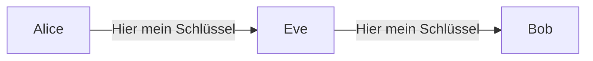
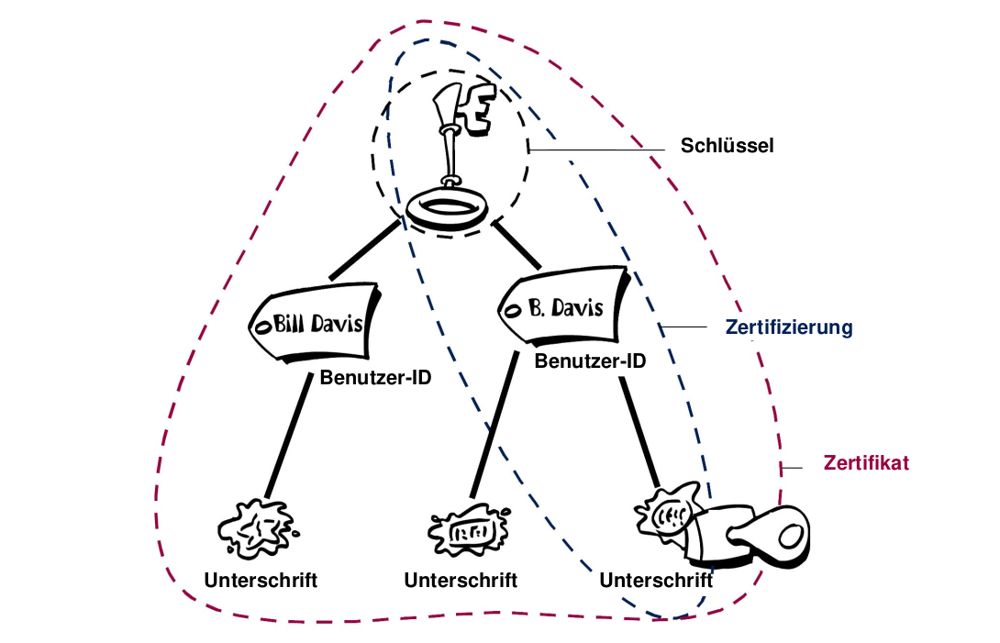

## Repetition und Digitalzertifikate

Was wir wissen sollten und neu dazu kommt.

🎯 Sie verstehen Zertifikate im Kontext der Verschlüsselung

---
### Repetition 

Wir erinnern:

**Symmetrische Verschlüsselung **

Gleicher Schlüssel, ungeeignet für lokale Daten.

**Symmetrische Verschlüsselung**

Öffentlicher und privater Schlüssel, geeignet für übertragene Nachrichten.

---

**Diffie-Helmann Schlüsseltausch**

Ein gemeinsamer geheimer Schlüssel über ein unsicheres Medium austauschen.

**Hash-Funktion**

Fingerabdruck von Daten erstellen und verifizieren.

---

**Direktes Vertrauen**

Der Sender muss dem Empfänger vertrauen und umgkehert.

**Signieren**

#FIXME

---
### Verschlüsselung im Web

Q: Wie weiss ich, dass meine Web-Verbindung verschlüsselt ist?

A: BILD_HTTPS

Q: Wie weiss ich, dass ich auf der richtigen Seite bin?

---
### Umgebungen mit öffentlichen Schlüsseln

Das Web wie auch der verschlüsselte Mail-Verkehr sind Umgebungen mit öffentlichen Schlüsseln.

Wenn wir jemanden vertrauen, vertrauen wir dem öffentlichen Schlüssel.

Q: Wie kann ich Daten mit einer Person austauschen, der ich noch nie begegnet bin?

---
### Sicherheitsproblem und Lösung.

Ein einfacher Abfangriff?

Q: Wie kann Bob den empfangen Schlüssel verifizieren?

---
### Digitalzertifikate

Mit Digitalzertifikaten wird der Eigentümer eines Schlüssels überprüfbar.

Ihr Ausweis enthält Informationen, die ihre Identität nachweist.

---
### Elemente eines Digitalzertifikats

Ein Digitalzertifikat besteht aus folgenden Elementen:
* Einem öffentlichen Schlüssel.
* Zertifikatsdaten (Beispielsweise der Name, die Benutzer-ID etc.).
** Einer oder mehreren digitalen Unterschriften.

---

---
### Lebenszyklus eines Digitalzertifikats

---
### Zertifikatsformate

---
### X.509

---