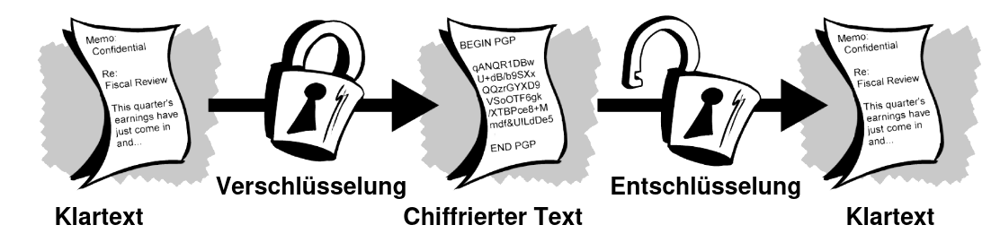

# Slides Thema 2
## Geschichte der Kryptographie

... und ein paar neue Begriffe.

🎯 Sie verstehen was Kryptographie und die symmetrische Verschlüsselung ist.

---

### Alltäglich

> Wir begegnen Kryptographie jeden Tag.

* Zahlung Kreditkarte 💳
* Verluste beim Bitcoin-Traden 📉
* Mit Wifi verbinden 📶
* Aufruf einer Website 🖥️

---

### Bei der Arbeit umso wichtiger

> Digitale Informationen müssen geschützt werden.

* Patientendaten im Spital 🏥
* Login-Informationen im Browser 🔓
* Zugang zu Geräten 💻

---

### Herkunft

> Kryptographie ist eine Entdeckung der Mathematik und ist heute allgegenwärtig.

---

### Viele Fragen

* Wie funktioniert Kryptographie?
* Warum ist Kryptographie wichtig?
* Welche Arten von Kryptographie werden heute verwendet?
* Wie wird Kryptographie in der Sicherheit eingesetzt?
* Wie kann Kryptographie von durchschnittlichen Benutzern verwendet werden?

---

### Funktionsweise

---

### Begriffe

**Verschlüsselung** 🔒: Herstellung von Klartext-Nachricht in eine Geheimtext-Nachricht (nicht lesbare).

**Entschlüsselung** 🔓: Verwendung eines geheimen Schlüssels zur Entschlüsselung eines Geheimtext.

**Chiffre** 🛡️: Verwendeter Algorithmus zur Verschlüsselung und Entschlüsselung einer Nachricht.

---

### Vor dem Computer

* 1500 v. Chr. Tontafeln aus Mesopotamien weisen Anzeichen von Verschlüsselung auf
* 500 bis 600 v. Chr. verwenden hebräeische Gelehrte eine alphabetische Substitutionschiffre (A = Y, B = W, C = G usw.)

---

### In Kriegszeiten besonders gefragt

* Im 18. Jahrundert verwenden britische Streitkräfte Formen der Kryptographie zur Kommunikation zwischen Generälen
* Im Zweiten Weltkrieg wurden mechanische und elektromechanische Chiffriermaschinen eingesetzt (Enigma-Maschine)
* Alan Turing hat unter anderem Techniken entwickelt um deutsche Chiffren zu brechen

🧠 Nice to know: [GNU/Linux.ch - Was ist eine Turing Maschine?](https://gnulinux.ch/was-ist-eine-turing-maschine)

---

### Krypto-Begriffe

Hat nichts mit Bitcoin zu tun.

* **Kryptographie**: Wissenschaft der Datensicherung
* **Kryptoanalyse**: Wissenschaft der Analyse und Entschlüsselung von verschlüsselter Daten
* **Kryptologie**: Umfasst Kryptographie und Kryptoanalyse

---

### Der gleiche Schlüssel?

ℹ️  Der gleiche Schlüssel wird für Ver- und Entschlüsselung verwendet.

---

### Symmetrische Verschlüsselung

Es handelt sich hierbei um die symmetrische Verschlüsselung.

---

### Ein Beispiel von Cäsar

Beispiel anhand einer Ersetzungsschiffre.

Die Position der Buchstaben wird verschoben.

---

### Aufgaben

🎬 Lösen Sie die [Aufgaben](excercise2.md#Aufgaben) 1 in Gruppen oder Breakout-Rooms.

---

### Sicherheitsprobleme

Sie haben es vermutlich festgestellt, die Cäsar-Verschlüsselung ist keine sichere Verschlüsselung:

* Leicht zu entziffern
* Schlüssel-Länge ist limitiert
* Kommunikation über mehre Kanäle

---

### Cäsar mit Python

Hier die Implementation der Cäsar-Verschlüssel als Python-Programm:

<iframe src="https://trinket.io/embed/python3/50ceaaf323" width="100%" height="356" frameborder="0" marginwidth="0" marginheight="0" allowfullscreen></iframe>

### Brute-Force Attacke

Die Cäsar-Verschlüsselung kann relativ einfach geknackt werden:

<iframe src="https://trinket.io/embed/python3/2805b9db5b" width="100%" height="356" frameborder="0" marginwidth="0" marginheight="0" allowfullscreen></iframe>

ℹ️ Bei Brute-Force Attacke werden zufällige Schlüssel generiert und ausprobiert.

---

### Stärken und Schwächen

der symmetrischen Verschlüsselung:

➕ Ver- und Entschlüssel ist sehr schnell  
➖ Nicht geeignet für Daten, die übertragen werden

---

### Mermkale der symmetischen Verschlüsselung

* Der Sender und Empfänger müssen den Schlüssel kennen -> Austausch über separaten Kanal -> Gefahr von Zugriff durch Unbefugte
* Geeignet für Verschlüsselung von lokaler Datenbank, Festplatte oder Daten auf Smartphone

---

### Sicherheit

Verschlüsselungsverfahren geheim gehalten oder veröffentlichen?

> Verschleierung ist keine Sicherheit

ℹ️ "security by obscurity" hat sich als untauglich erwiesen.

Die Lösung ...

---

### Das von Prinzip von Kerckhoffs

* Prinzip zur Entwicklung von Chiffrierverfahren
* Entwickelt vom niederländischen Kryptologen Kerckhooffs

> Die Sicherheit eines Chiffriersystems darf nicht davon abhängen, ob das benutzte Verfahren zum Ver- und Entschlüsseln bekannt ist. Die Sicherheit soll nur auf der Geheimhaltung von Schlüsseln beruhen.

---

### Gute kryptografische Verfahren

erfüllen heute in der Regel diese Kriterien:

- Sie beruhen auf dem Kerckhoffs-Prinzip
- Sie werden von Kryptologen (bzw. -analytikern) weltweit untersucht
- Sie durchlaufen erfolgreich alle möglichen Angriffszenarien.

---

### Wer untersucht die Verfahren?

 * National Institute of Standards and Technology (NIST)
 * ISO, RFC, IEEE
