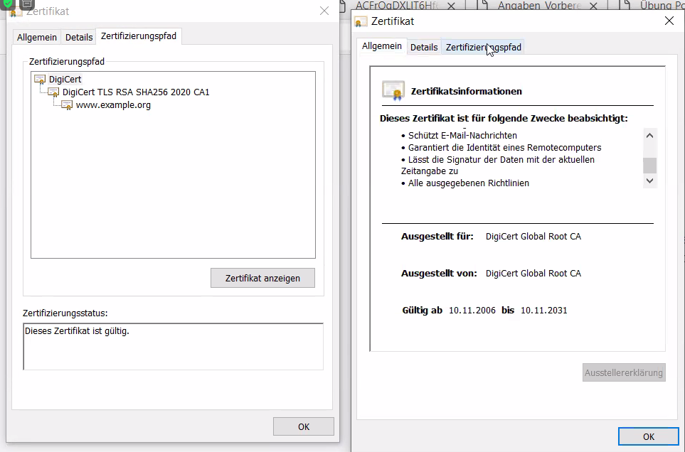

## Übungen

zu [Thema 2 - Zertifikate und Protokolle](README.md).

### Aufgabe 1 - Zertifikat betrachten

Wir schauen uns ein Zertifkat an. Öffnen Sie die Adresse <https://example.com> in ihrem Browser und schauen Sie sich das Zertifikat an. Hier das Vorgehen im Firefox:

Beantworten Sie die folgenden Fragen:

* Wie lange ist das Zertifikat gültig?
* Sie lautet die Seriennummer des Zertifikats?
* Wie lautet die Kennung des Zertifikatsinhabers?
* Wie lautet der Name des Zertifikatsausstellers?
* Welcher Signaturalgorithmus ist zum Einsatz gekommen?

### Aufgabe 2 - Zertifikat verifizieren

Öffnen Sie das Zertifikat zu <https://example.com> erneut. Überprüfen Sie die Zertifikatskette und kopieren Sie den SHA1-Fingerprint des Root-Zertifikats und merken Sie sich den *Common Name*.

Der Fingerpint sieht ungefähr so aus: `A8:98:5D:3A:65:E5:E5:C4:B2:D7:D6:6D:40:C6:DD:2F:B1:9C:54:36` und der Name kann `DigiCert Global Root CA` sein.

Suchen Sie das Root-Zertifikat in den Einstellungen des Browsers. Bei Firefox navigieren Sie nach *Einstellungen > Datenschutz & Sicherheit > Sicherheit > Zertifikate anzeigen ...* und öffnen den Tab *Zertifizierungsstellen*. Exportieren Sie das Zertifikate und importieren Sie es in *Kleopatra*.

Vergleichen Sie den Browser-Fingerabdruck mit dem Fingerabdruck in Kleopatra. Stimmer dieser überein?

Hinweis: In Windows kann das Root-Zertifikat wie folgt angezeigt werden.

Das Zertifikat ist auch im Zertifikats-Manager verfügbar.

Aktuell ist unklar wie man Zertifikat exportieren und mit Kleopatra importieren kann.

### Aufgabe 3 - SSL Check

Öffnen Sie die Webseite <https://www.ssllabs.com> und geben Sie die Adresse `remote.clean-serviceag.ch` ein und starten Sie den Scan-Vorgang. Wenn Sie das Resultat erhalten, beanworten Sie die folgenden Fragen:

* Was würden Sie dem Betreiber der Webseite mitteilen?
* Warum ist diese Bewertung ein Sicherheitsproblem?

