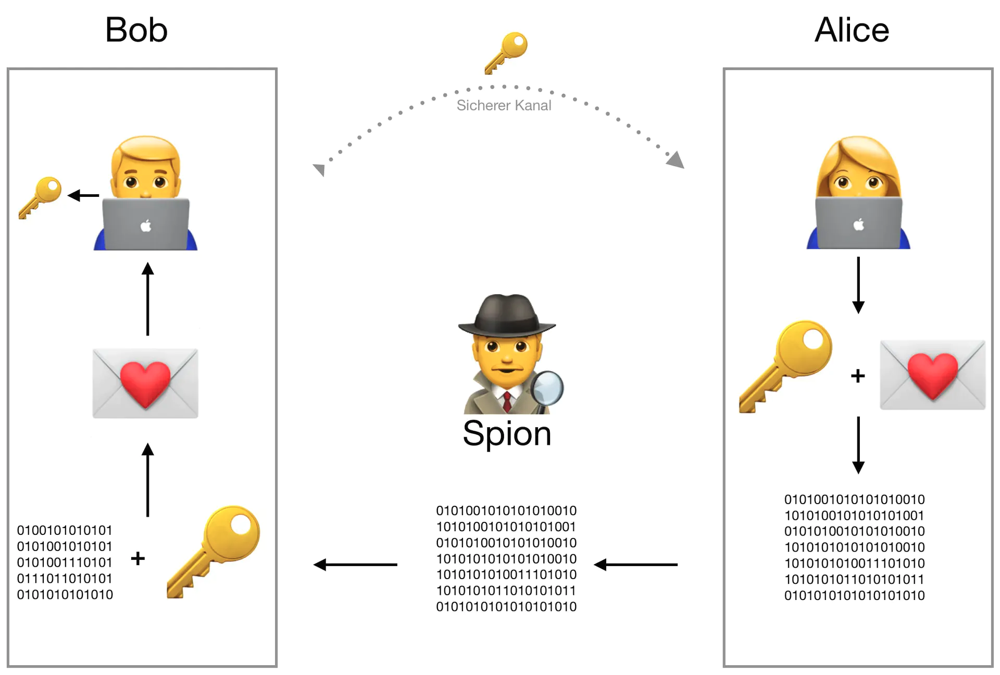
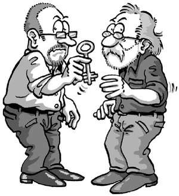
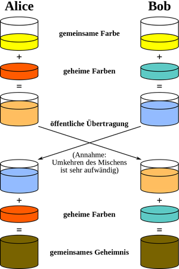
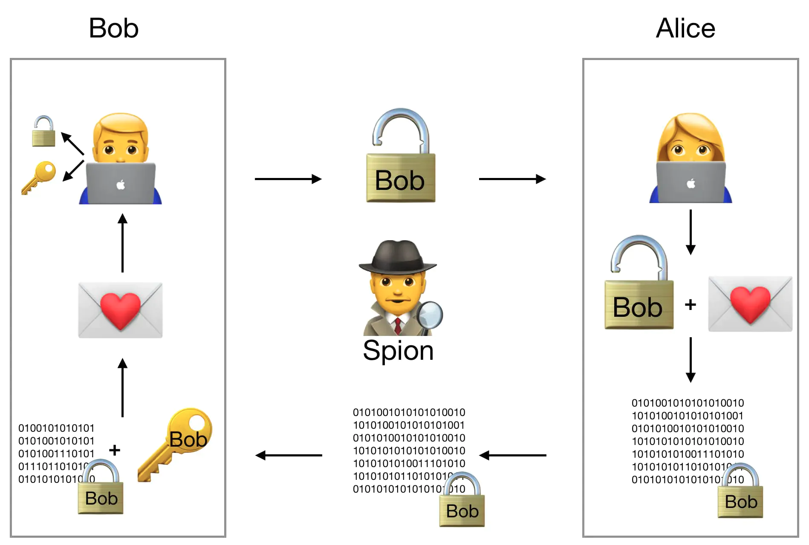
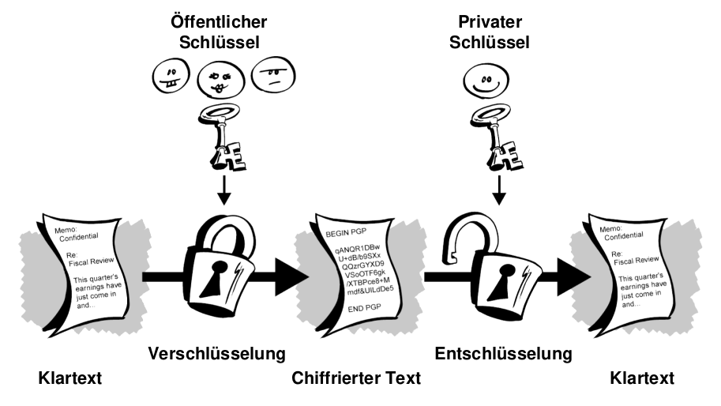

# Slides Thema 3
## Bausteine der Kryptographie

... und wie man Sie anwendet.

🎯 Sie verstehen weitere Elemente der Kryptographie und wissen was die asymmetrische Verschlüsselung ist.

---

### Krypto Primitive

Krypto Primitive sind die Grundbausteine. Wir kennen:

* Symmetrische Verschlüsselung
* Asymmetrische Verschlüsselung

Es gibt noch:

* Diffie Hellmann-Schlüsseltausch
* Hash-Verfahren
* uvw.

---

### Sicherheitsproblem Schlüsseltausch

Bei der symmetrischen Verschlüsselung brauchen **Sender und Empfänger den gleichen Schlüssel**.

Wenn die verschlüsselte Nachricht und der Schlüssel über den **gleichen Kanal** versendet werden, ist die V**erschlüsselung faktsich nutzlos**.

Man könnte verschiedene Kanäle nutzen (Browser, E-Mail, SMS, App, ...), aber das erhöht den Koordinationsaufwand.


ℹ️  In der physischen Welt begegnen wir 

---

### Diffie Hellmann Schlüsselaustausch

> Kann man einen Schlüssel über ein unsicheres Medium austauschen?  



Die Wissenschaflter Whitfield Diffie und Martin Hellman haben 1976 festgestellt: **Ja, man kann.**

---

### Der DH-Algorithmus

DH-Algorithmus is komplex, dafür gibt es eine schöne Analogie mit Farben.

1.  Alice und Bob einigen sich auf eine gemeinsame (öffentliche) Farbe
2.  Jeder wählt sich zudem eine geheime Farbe
3.  Alice und Bob mischen sich aus ihrer geheimen und der öffentlichen Farbe eine weitere Farbe
4. Die gemischte Farbe tauschen sie aus und mischen diese mit ihrer Geheimfarbe.
5. Das letzte Gemisch kennen nur Alice und Bob und sonst niemand.

Ziel ist es, dass Alice und Bob einen **gemeinsamen** geheimen Schlüssel haben.

---

### Veranschaulichung DH

[](https://raw.githubusercontent.com/janikvonrotz/encrypt.casa/main/diffie-hellmann-farbe.png)

---

### Funktionsweise DH

Verschlüsselungart für den DH-Schlüsseltausch ist die asymmetrische Verschlüsselung.

---

### Unterschiedliche Schlüssel

Bei  der asymmetrischen Verschlüsselung haben wir einen privaten und einen öffentlichen Schlüssel. Der öffentliche Schlüssel ist hier das Schloss:



---

### Asymmetrische Verschlüsselung

Hier das Ver- und Entschlüsselungsverfahren:



🤔  Kann man auch mit dem privaten Schlüssel eine Nachricht verschlüsseln?

---

### Public und Private Key

Man unterscheidet zwischen Public und Private Key

* Public Key ist öffentlich 📢 und dient der Verschlüsselung 🔒
* Private Key ist geheim 🤫 und dient der Entschlüsselung 🔓

ℹ️  Die Verschlüsselung muss mathematisch schwer umkehrbar sein!

---

### Problem der Asymmetrischen Verschlüsselung

➖ Algorithmen zur asymmetrischen Verschlüssselung sind zeitaufwendig  
➕ Kein sicherer Schlüsselaustausch nötig

---

### Aufgaben

🎬 Lösen Sie die [Aufgaben](excercise3.md#Aufgaben) 1 in Gruppen oder Breakout-Rooms.

---

### Fingerabdruck beim Menschen

 Fingerabdrücke werden benutzt, um Personen mit wenigen Eigenschaften zu identifizieren.
 


🤔 Gleicher Fingerabdruck heisst gleiche Person -> Wie erstellt man einen digitalen Fingerabdruck?

---

### Hash-Funktionen

> Ordnet eine Zeichenketter einer neuen Zeichenketten mit einer festen und vorgegebenen Länge zu.


---

### Arten von Hashes

Welche *Secure Hash Algorithms* (SHA) gibt es?

**SHA-1**: Korrigierte Version von SHA-0. Inzwischen unsicher.

**SHA-2**: Beinhaltet SHA-224, SHA-256, SHA-384 und SHA-512. Die Nummer ist die jeweilige Schlüssellänge.

**SHA-3**: Neuster und sicherster Hash-Algorithmus.

**MD5**: Verbreitet und sehr unsicher.

---

### SHA265 mit Python

<iframe src="https://trinket.io/embed/python3/2b43c7b642" width="100%" height="356" frameborder="0" marginwidth="0" marginheight="0" allowfullscreen></iframe>

---

### Einwegfunktion

> Bei einer Einwegfunktion ist es praktisch unmöglich, aus einem möglichen Zielwert einen Ausgangswert so zu bestimmen.


---

### Quersumme als Hash-Funktion

Wir möchten die Zahlen 79847 und 67967 mitteilen und mit Prüfsumme sichern.

```js
7+8+9+4+7
// 35
6+7+9+6+7
// 35
```

🤔  Was ist hier das Problem?

---

### Kollisionsresistenz

Die Quersumme hat eine **schwache Kollisionsresistenz**.

SHA-256 hat eine **starke Kollisionsresistenz**

Mit Zweiteren ist es fast unmöglich zweimal der Gleiche Ausgangswert zu finden.

---

### Angriffszenarien

**Kollisionsangriff**: Der Angreifer versucht verschiedene Dokumente mit denselben Hashwerten zu erzeugen. 

🧠 Nice to know: [Shattered](https://shattered.io/)

---

### Anwendung

von Hashes:
* Passwörter werden als Hash gespeichert
* Dokumente, Dateien verifizieren (Integrität 💎)
