# Übungen Thema 4

## Aufgaben

### Aufgabe 1 - Elektronische Unterschrift

In dieser Aufgabe möchten wir eine PDF-Datei elektronisch signieren und die Unterschrift von ein anderen Person verifizieren.

#### Ablauf

Sie erhalten einen Vertrag als PDF-Datei, eine Unterschrift-Datei sowie einen dazugehörgien Public Key von [Adobe](https://www.adobe.com/).

Das Sie dem Absender vertrauen nehmen Sie den Public Key in ihren Schlüsselbund auf.

Der Vertrag wurde von Adobe unterschrieben. Sie verfizieren die Unterschrift und stellen sicher, dass der Vertrag nicht verändert wurde.

Anschliessend unterschreiben Sie den Vertrag mit ihrem eigenen Schlüssel.

#### Vorbereitung

Installieren Sie als erstes eine GnuPG-Schlüsselverwaltungssoftware:

Windows: [Gpg4win](https://www.gpg4win.org/) (Direkter [Link](https://github.com/janikvonrotz/encrypt.casa/raw/main/attachments/gpg4win-4.1.0.exe))\
Linux: [Kleopatra](https://www.openpgp.org/software/kleopatra/)

Bereiten Sie die Software wie folgt vor.

* Erstellen Sie ein Schlüsselpaar (dazu ein Beispiel)

Name: `Vorname Nachname`\
Mail: `vorname.nachname@example.com`\
Key size: `2048`\
Algorithm: `RSA & RSA`

* Setzen Sie ein Passwort für den privaten Schlüssel


#### Durchführung

* Laden Sie die PDF-Datei herunter: [Acme-NDA.pdf](https://github.com/janikvonrotz/encrypt.casa/raw/main/Acme-NDA.pdf)
* Und die Unterschrift-Datei: [Acme-NDA.pdf.sig](https://github.com/janikvonrotz/encrypt.casa/raw/main/Acme-NDA.pdf.sig)


* Versuchen Sie die PDF-Datei zu verfizieren. Es sollte ohne Public Key nicht möglich sein.

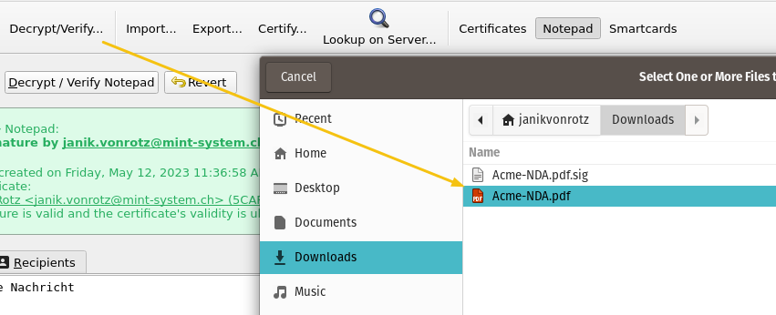

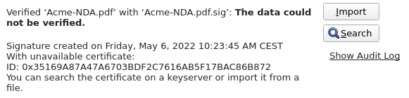

* Laden Sie den Public Key herunter: [Adobe-Public-Key.asc](https://github.com/janikvonrotz/encrypt.casa/raw/main/Adobe-Public-Key.asc)


* Importieren Sie den Public Key in ihren Schlüsselbund.

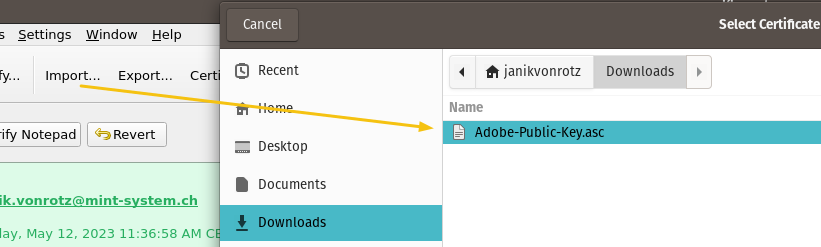

* Verifizieren Sie die PDF-Datei erneut. Der Schlüssel wird erkannt, aber nicht vertraut.

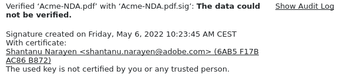
* Zertifizieren Sie den importierten Schlüssels und verifizieren Sie die PDF-Datei erneut.

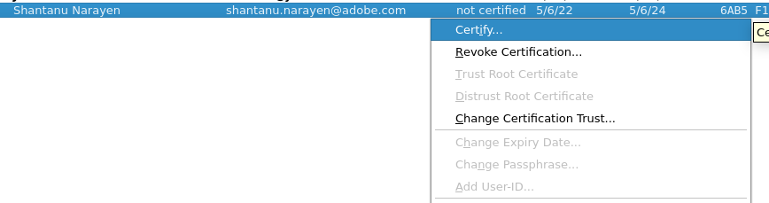

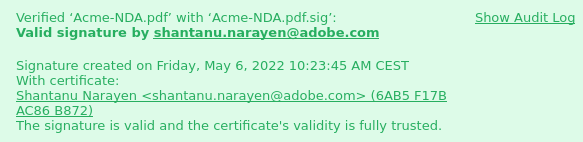

* Signieren Sie die PDF-Datei mit ihrem eigenen Schlüssel.

### Aufgabe 2 - Verschlüsselte E-Mails

In dieser Übung möchten wir mit GnuPG verschlüsselte und signierte E-Mails austauschen.

#### Ablauf

Hier folgt nun ein Ablauf, den wir anschliessend mit dem E-Mail-Programm und Schlüsselverwaltung durchführen möchten.

Wir haben zwei Teilnehmer `alice@example.com` und `bob@example.com`.


Bob vertraut dem Absender und nimmt den öffentlichen Schlüssel von Alice in seinen Schlüsselbund auf.

Bob verschlüsselt seinen öffentlichen Schlüssel mit dem öffentlichen Schlüssel von Alice und sendet diesen an Alice.

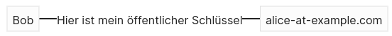

Alice entschlüsselt den öffentlichen Schlüssel von Bob und nimmt diesen in den Schlüsselbund auf.

ℹ️ Der öffentliche Schlüssel kann auch unverschlüssel übertragen werden.

Nun kann Alice irgendeine Nachricht mit dem öffentlichen Schlüssel von Bob verschlüsseln und schicken. Ausschliesslich Bob kann die Nachricht entschlüsseln und lesen.

#### Vorbereitung

* Öffnen Sie Software für die Schlüsselverwaltung.
* Exportieren Sie den öffentlichen Schlüssel in ein Notepad. Hier ein Beispiel:

**example.asc**

```
-----BEGIN PGP PUBLIC KEY BLOCK-----

mQENBGCl+ncBCAC76XE5mzoD3A2Zi8yubYf9MezIVQk3MkiZtsL20bzzWNf5Dmt2
Sp0ZWPPozS91ERRe2KJgA9FJIzLGClMBPtRmx57tvzCZ7odHx60BKVol/R0ICd1C
lfCruItGbOqcB4r93DKLuTJBBVaxe5uS7U27HNi8gSuf2xnx4y7eO5CHJRna59bi

...

xTAF7qS+fUk2Kcvl0r+yKFCwtDReDo4fN0KhBf6Ef5qNIazwoPie4JS6AY08OpaA
Gm8mBS9lnn+Y+PThZN/PcWACaQGR4g+p1xDufyrgtUPpGEKiueybeWkgw1pIpCeJ
gKMMy+KwcP8JBxJDCExsUt3fzWxtsbaYiRmN5lWRreuKgpzCUR86/IjrusXziJ8L
J6d0
=c7Rj
-----END PGP PUBLIC KEY BLOCK-----
```

* Öffnen Sie ihr E-Mail-Programm oder Moodle-Chat und teilen Sie ihre E-Mail-Adressen dem Nachbarn mit.

#### Durchführung

🎬 Führen Sie den beschriebenen Ablauf nun selber durch. Falls Sie niemanden zum anschreiben haben, versuchen Sie es mit <adele@gnupp.de>. Das ist ein Bot und sollte den geschilderten Ablauf unterstützen.

🎬 Führen Sie Ablauf nochmals durch, jedoch signieren Sie die Nachricht, statt Sie zu verschlüsseln.

### Aufgabe 3 - Zertifikat auf Server publizieren

Statt den Schlüsseltausch manuell durchzuführen, wollen wir dazu einen Keyserver verwenden.

#### Ablauf

Sie erstellen ein neues Schlüsselpaar mit einer gültigen E-Mail-Adresse.

Mit Kleopatra veröffentlichen Sie das Zertifikat auf einem Server. Sie erhalten eine E-Mail zur Bestätigung.

Sie tauschen mit ihrem Kontakt eine signtierte Nachricht aus. Der Kontakt kann die Nachricht mit dem veröffentlichten Zertifikat

#### Durchführung

* Veröffentlichen Sie das Zertifikat mit der entsprechenden Funktion in Kleopatra.

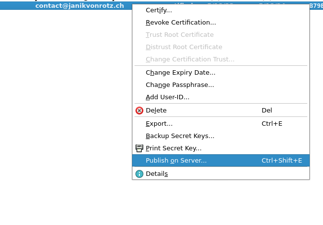
* Bestätigen Sie die E-Mail-Adresse.

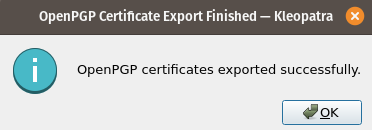

* Öffnen Sie den Link <https://keys.openpgp.org/> im Browser
* Suchen Sie nach dem hochgeladenen Zertifikat.

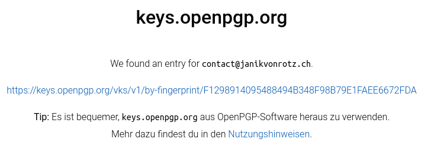

* Signieren Sie eine Nachricht mit ihrem Schlüssel.

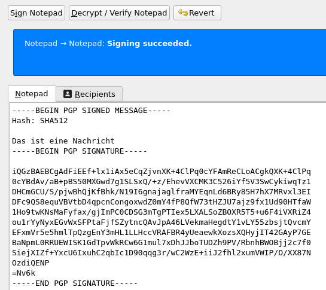

* Versenden Sie die Nachricht an ihren Kontakt via E-Mail oder Moodle-Chat
* Der Empfänger verifiziert ihre Nachricht. Dazu importiert das Zertifikat vom Server.

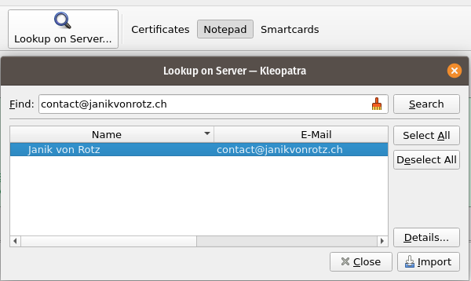