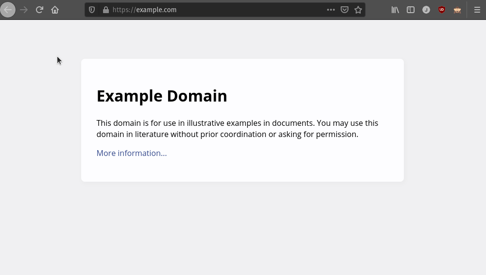

# Übungen Thema 5

## Aufgaben

### Aufgabe 1 - Zertifikat betrachten

Wir schauen uns ein Zertifkat an. Öffnen Sie die Adresse <https://example.com> in ihrem Browser und schauen Sie sich das Zertifikat an. Hier das Vorgehen in Firefox:

Beantworten Sie die folgenden Fragen:

* Wie lange ist das Zertifikat gültig?
* Sie lautet die Seriennummer des Zertifikats?
* Wie lautet die Kennung des Zertifikatsinhabers?
* Wie lautet der Name des Zertifikatsausstellers?
* Welcher Signaturalgorithmus ist zum Einsatz gekommen?