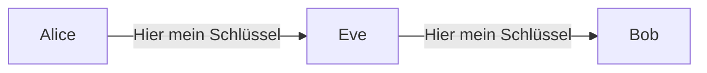
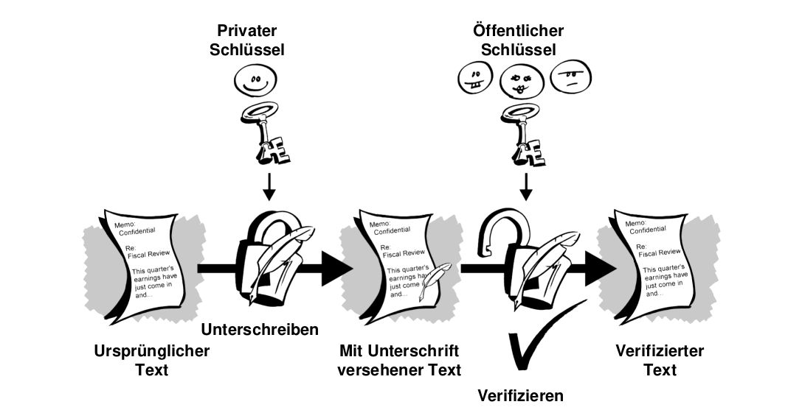
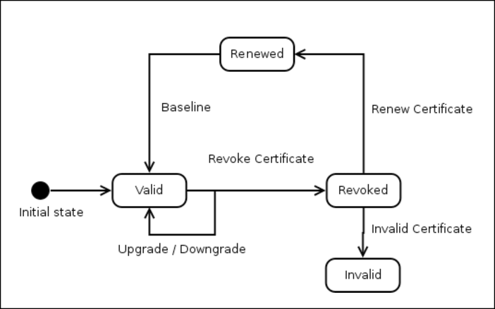
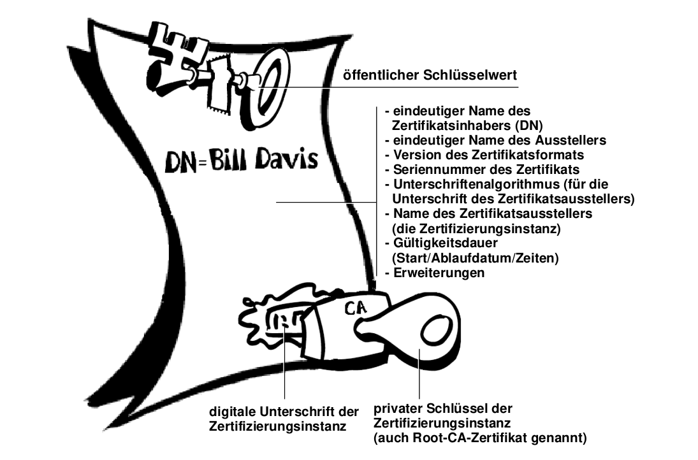

# Slides Thema 5
## Repetition und Digitalzertifikate

... was wir wissen sollten und neu dazu kommt.

🎯 Sie verstehen Digitalzertifikate im Kontext der Verschlüsselung.

---
### Repetition 

Wir erinnern uns:

**Symmetrische Verschlüsselung 🔑🔑**

Gleicher Schlüssel, geeignet für lokale Daten.

**Asymmetrische Verschlüsselung 🔑🗝️**

Öffentlicher und privater Schlüssel, geeignet für übertragene Nachrichten.

---

**Diffie-Helmann Schlüsseltausch 🔀**

Ein gemeinsamer geheimer Schlüssel über ein unsicheres Medium austauschen.

**Hash-Funktion 🐾**

Fingerabdruck von Daten erstellen und verifizieren.

---

**Direktes Vertrauen 🧍🧍**

Der Sender muss dem Empfänger vertrauen und umgkehert.

**Unterschreiben/Signieren 📝**

Nachricht mit privatem Schlüssel verschlüsseln.

---
### Verschlüsselung im Web

🤔 Wie weiss ich, dass meine Web-Verbindung verschlüsselt ist?

🙋 

🤔 Wie weiss ich, dass ich auf der richtigen Seite bin?

---
### Umgebungen mit öffentlichen Schlüsseln

> Das Web wie auch der verschlüsselte Mail-Verkehr sind Umgebungen mit öffentlichen Schlüsseln.

---

Wenn wir jemanden vertrauen, vertrauen wir dem öffentlichen Schlüssel.

🤔 Wie kann ich Daten mit einer Person austauschen, der ich noch nie begegnet bin?

---
### Sicherheitsproblem mit öffentlichen Schlüsseln

Ein einfacher Abfang-Angriff:

🤔 Wie kann Bob den empfangen Schlüssel verifizieren?

---
### Digitalzertifikate

> Mit Digitalzertifikaten wird der Eigentümer eines Schlüssels überprüfbar.

Beispiel: Ihr Ausweis enthält Informationen, die ihre Identität nachweist.

---
### Elemente eines Digitalzertifikats

Ein Digitalzertifikat besteht aus folgenden Elementen:
* Einem öffentlichen Schlüssel
* Zertifikatsdaten (Beispielsweise der Name, die Benutzer-ID etc.)
* Einer oder mehreren digitalen Unterschriften

---

---
### Digitale Unterschrift

---
### Lebenszyklus eines Digitalzertifikats

Zertifiakte werden ausgestellt, erneuert, unterschrieben, zurückgenommen, validiert, ...

---
### Zertifikatsformate

Wir betrachten zwei Zertifikatsformate:
* PGP-Zertifikate
* X.509-Zertifikate

---
### PGP-Zertifikate

Enthält diese Informationen:
* PGP-Versionsnummer
* Öffentlicher Schlüssel des Zertifikatinhabers
* Daten des Zertifikatinhabers
* Gültigkeitsdauer des Zertifikats
* Bevorzugter symmetrischer Verschlüsselungsalgorithmus für die Schlüssel

---

---

### X.509

Ist das bekannteste Format mit folgenden Daten:

* X.509-Versionsnummer
* Öffentlicher Schlüssel des Zertifikatinhabers
* Seriennummer des Zertifikats
* Eindeutige Kennung des Zertifikatsinhabers

---

* Gültigkeitsdauer des Zertifikats
* Eindeutiger Names des Zertifikatsausstellers
* Digitiale Unterschrift des Ausstellers
* Kennung für Unterschriftenalgorithmus

---

---
### Unterschiede PGP und X.509

Es bestehen viele Unterschiede hier die wichtigsten:

* **PGP-Zertifikat kann selber erstellt werden, X.509 nur durch Zertifizierungsinstanz**
* X.509 unterstützen einen Namen für Schlüsseleigentümer
* X.509 unterstützt eine Unterschrift zur Bestätigung der Gültigkeit

---
### Aufgaben

🎬 Lösen Sie die [Aufgaben](excercise5.md#Aufgaben) 1 in Gruppen oder Breakout-Rooms.

---
### Gültigkeit und Vertrauen

🤔 Wie kann man nun die Gültigkeit eines Zertifikats verfizieren?
