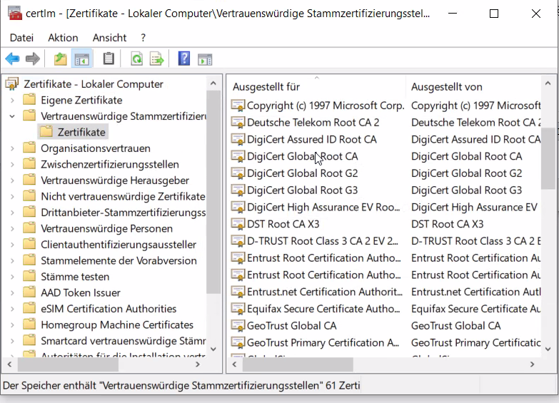

# Übungen Thema 6

## Aufgaben

### Aufgabe 1 - Zertifikat verifizieren

Öffnen Sie das Zertifikat zu <https://example.com> erneut. Überprüfen Sie die Zertifikatskette und kopieren Sie den SHA1-Fingerprint des Root-Zertifikats und merken Sie sich den *Common Name*.

Der Fingerpint sieht ungefähr so aus: `A8:98:5D:3A:65:E5:E5:C4:B2:D7:D6:6D:40:C6:DD:2F:B1:9C:54:36` und der Name kann `DigiCert Global Root CA` sein.

Suchen Sie das Root-Zertifikat in den Einstellungen des Browsers. Bei Firefox navigieren Sie nach *Einstellungen > Datenschutz & Sicherheit > Sicherheit > Zertifikate anzeigen ...* und öffnen den Tab *Zertifizierungsstellen*. Exportieren Sie das Zertifikate und importieren Sie es in *Kleopatra*.

Vergleichen Sie den Browser-Fingerabdruck mit dem Fingerabdruck in Kleopatra. Stimmer dieser überein?

Hinweis: In Windows kann das Root-Zertifikat wie folgt angezeigt werden.

Das Zertifikat ist auch im Zertifikats-Manager verfügbar.

Aktuell ist unklar wie man Zertifikat exportieren und mit Kleopatra importieren kann.

### Aufgabe 2 - Windows-Computer Zertifikat

Versuchen Sie die foglenden Fragen zu beantworten:

* Gibt es ein Zertifikat für den eigenen Computer im Zertifikats-Manager?
* Wenn ja, wer hat das Zertifikat herausgegeben?
* Ist das Zertifikat allgemein gültig oder nur innerhalb des Unternehmensnetzwerkes?
* Für was braucht der Computer ein Zertifikat?