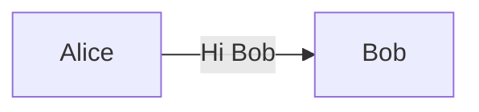
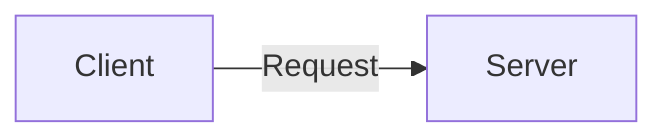
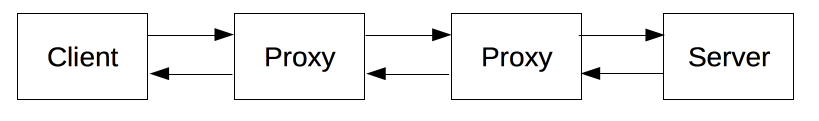
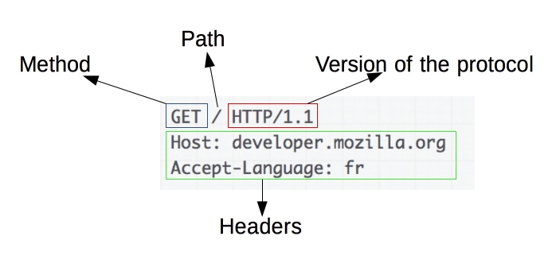
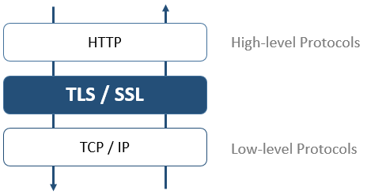
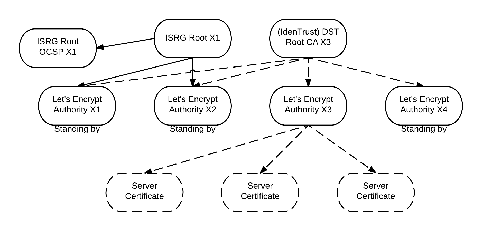
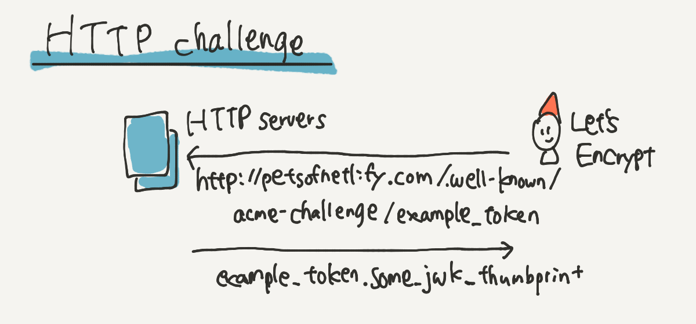
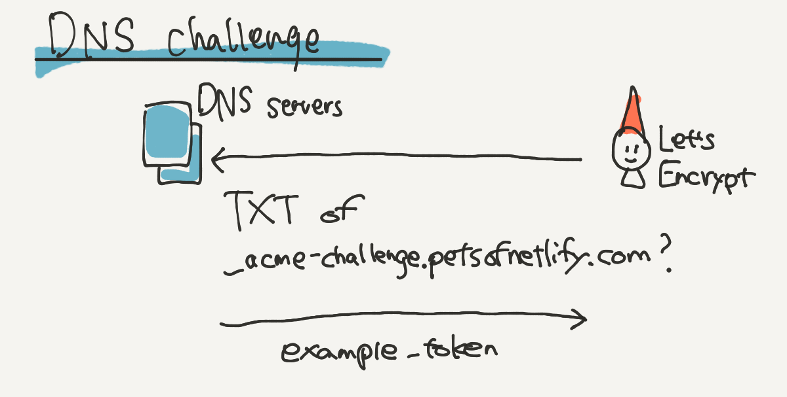
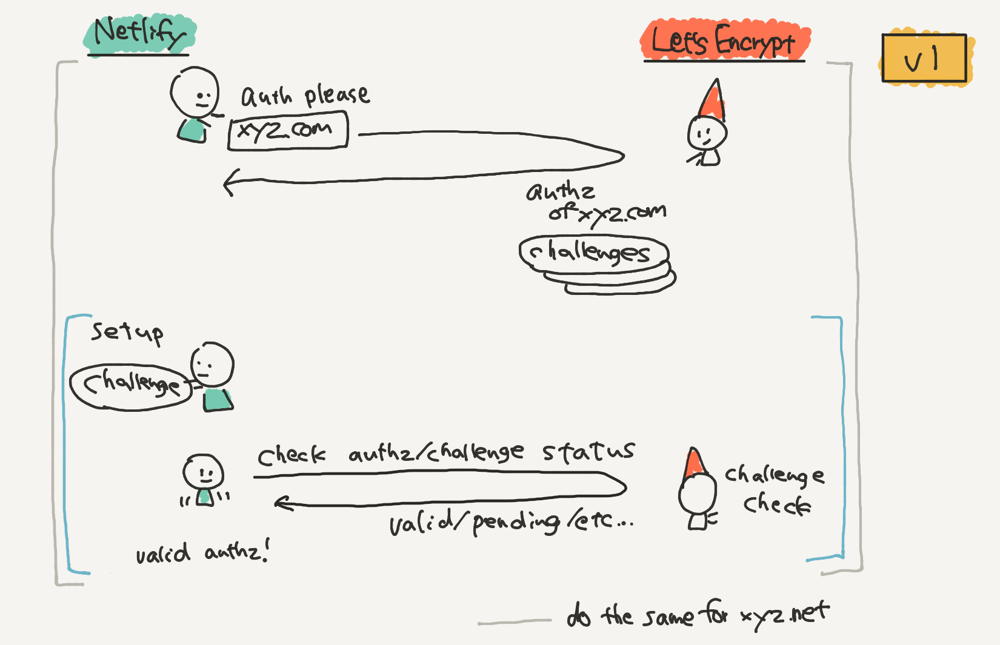
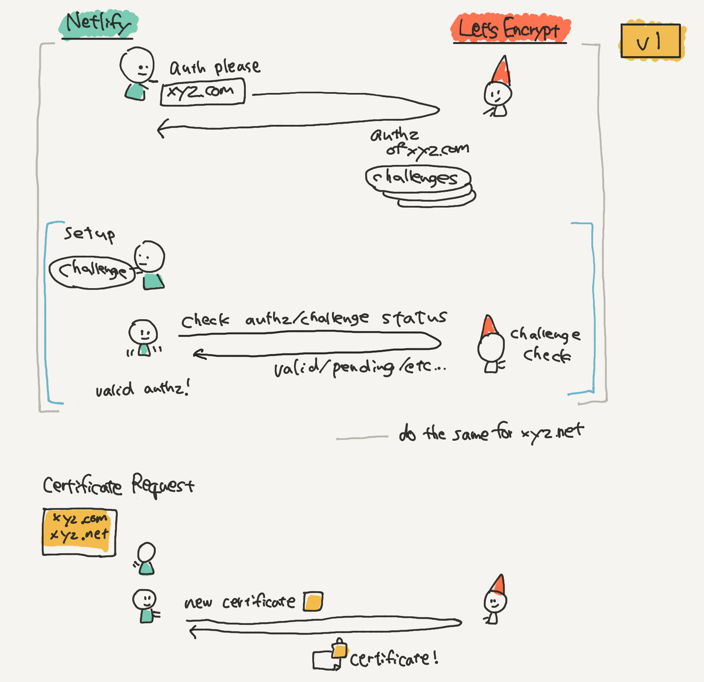

# Slides Thema 7
## Sichere Webprotokolle

und wie diese funktionieren.

🎯  Sie lernen sichere Protokolle kennen und können damit einen Webseitenaufruf nachvollziehen.

---
### Aufruf einer Webseite

Wenn wir eine Webseite aufrufen, dauert es weniger als eine Sekunde.


In dieser Sekunde passiert jedoch sehr viel.

---
### Nachrichtenaustausch

Wir erinnern uns an:



Jetzt ist es:



---
### URL

Eine Unified Resource Locater (URL) wird in der Adressleiste des Browsers eingegeben.


---
### IP-Adresse

Im Internet sind Geräte anhand der IP-Adresse erreichbar.  
↪️ Für eine Verbindungsaufnahme braucht es die IP-Adresse des Servers.



---
### Eigene IP-Adresse mit Python

<iframe src="https://trinket.io/embed/python3/aa282ed1b2" width="100%" height="356" frameborder="0" marginwidth="0" marginheight="0" allowfullscreen></iframe>

---
### Hostname

Damit man sich nicht IP-Adressen merken muss, kann einer IP-Adresse ein sprechender Name zugeordnet werden.

`93.184.216.34` <-> `www.example.com`.

---
### Hostname mit Python

<iframe src="https://trinket.io/embed/python3/3e3fe071aa" width="100%" height="356" frameborder="0" marginwidth="0" marginheight="0" allowfullscreen></iframe>

---
### DNS-Server

Der Domain-Name-System (DNS) Server verwaltet die Zuordnung Hostname und IP-Adresse.


---
### DNS mit Python

<iframe src="https://trinket.io/embed/python3/c2db81fc64" width="100%" height="356" frameborder="0" marginwidth="0" marginheight="0" allowfullscreen></iframe>

---
### HTTP

Der Browser kommuniziert mit  dem HyperText Transfer Protocol (HTTP). Das Protokoll ist einfach:

1. Anfrage: HTTP Reqeust
2. Antwort: HTTP Reponse

---
### HTTP Request



---
### HTTP Response


---
### HTTPS

Die Übertragung der Daten erfolgt in Klartext. Deshalb wurde HyperText Transfer Protocol **Secure** (HTTPS) entwickelt 🧐.

Der HTTP-Austausch wird hierbei mit einem Verschlüsselungsprotokoll geschützt:
* Secure Socket Layer (SSL)
* Transport Layer Security (TLS)

---



---
### SSL/TLS

-   SSL 1.0: Aufgrund von Sicherheitsproblemen nie öffentlich freigegeben.
-   SSL 2.0: Veröffentlicht 1995. Seit 2011 veraltet.
-   SSL 3.0: Veröffentlicht 1996. Seit 2015 veraltet.
-   TLS 1.0: 1999 als Upgrade auf SSL 3.0 veröffentlicht. Seit 2020 veraltet.

---

-   TLS 1.1: Veröffentlicht 2006. Seit 2020 veraltet.
-   TLS 1.2: Veröffentlicht 2008.
-   TLS 1.3: Veröffentlicht 2018.

Neue Angriffe -> Neue Sicherheitsprobleme -> Neue Algorithmen -> Neue Version

---
### TLS

* Verschlüsselungsprotokoll zur sicheren Datenübertragung im Internet
* Beim TLS Handshake findet ein sicherer Schlüsseltausch und Authentisierung statt
* Die Datenübertragung erfolgt mit symmetrischen Schlüssel

🧠 Good-to-know: Ab Version 1.3 findet Schlüsseltausch nur noch mit Diffie-Hellmann statt

---
### TLS-Handshake


---
### TLS-Handshake mit Curl

```bash
curl -v https://example.com
*   Trying 93.184.216.34:443...
* TCP_NODELAY set
* Connected to example.com (93.184.216.34) port 443 (#0)
* ALPN, offering h2
* ALPN, offering http/1.1
* successfully set certificate verify locations:
*   CAfile: /etc/ssl/certs/ca-certificates.crt
  CApath: /etc/ssl/certs
* TLSv1.3 (OUT), TLS handshake, Client hello (1):
* TLSv1.3 (IN), TLS handshake, Server hello (2):
* TLSv1.3 (OUT), TLS change cipher, Change cipher spec (1):
* TLSv1.3 (OUT), TLS handshake, Client hello (1):
* TLSv1.3 (IN), TLS handshake, Server hello (2):
* TLSv1.3 (IN), TLS handshake, Encrypted Extensions (8):
* TLSv1.3 (IN), TLS handshake, Certificate (11):
* TLSv1.3 (IN), TLS handshake, CERT verify (15):
* TLSv1.3 (IN), TLS handshake, Finished (20):
* TLSv1.3 (OUT), TLS handshake, Finished (20):
* SSL connection using TLSv1.3 / TLS_AES_256_GCM_SHA384
* ALPN, server accepted to use h2
* Server certificate:
*  subject: C=US; ST=California; L=Los Angeles; O=Internet Corporation for Assigned Names and Numbers; CN=www.example.org
*  start date: Nov 24 00:00:00 2020 GMT
*  expire date: Dec 25 23:59:59 2021 GMT
*  subjectAltName: host "example.com" matched cert's "example.com"
*  issuer: C=US; O=DigiCert Inc; CN=DigiCert TLS RSA SHA256 2020 CA1
*  SSL certificate verify ok.
* Using HTTP2, server supports multi-use
* Connection state changed (HTTP/2 confirmed)
* Copying HTTP/2 data in stream buffer to connection buffer after upgrade: len=0
* Using Stream ID: 1 (easy handle 0x56152e9a5ea0)
> GET / HTTP/2
> Host: example.com
> user-agent: curl/7.68.0
> accept: */*
>
* TLSv1.3 (IN), TLS handshake, Newsession Ticket (4):
* TLSv1.3 (IN), TLS handshake, Newsession Ticket (4):
* old SSL session ID is stale, removing
* Connection state changed (MAX_CONCURRENT_STREAMS == 100)!
< HTTP/2 200
< age: 596248
< cache-control: max-age=604800
< content-type: text/html; charset=UTF-8
< date: Thu, 03 Jun 2021 13:47:23 GMT
< etag: "3147526947+ident"
< expires: Thu, 10 Jun 2021 13:47:23 GMT
< last-modified: Thu, 17 Oct 2019 07:18:26 GMT
< server: ECS (dcb/7F5B)
< vary: Accept-Encoding
< x-cache: HIT
< content-length: 1256
<
<!doctype html>
<html>
<head>
    <title>Example Domain</title>

    <meta charset="utf-8" />
    <meta http-equiv="Content-type" content="text/html; charset=utf-8" />
    <meta name="viewport" content="width=device-width, initial-scale=1" />
    <style type="text/css">
    body {
        background-color: #f0f0f2;
        margin: 0;
        padding: 0;
        font-family: -apple-system, system-ui, BlinkMacSystemFont, "Segoe UI", "Open Sans", "Helvetica Neue", Helvetica, Arial, sans-serif;

    }
    div {
        width: 600px;
        margin: 5em auto;
        padding: 2em;
        background-color: #fdfdff;
        border-radius: 0.5em;
        box-shadow: 2px 3px 7px 2px rgba(0,0,0,0.02);
    }
    a:link, a:visited {
        color: #38488f;
        text-decoration: none;
    }
    @media (max-width: 700px) {
        div {
            margin: 0 auto;
            width: auto;
        }
    }
    </style>
</head>

<body>
<div>
    <h1>Example Domain</h1>
    <p>This domain is for use in illustrative examples in documents. You may use this
    domain in literature without prior coordination or asking for permission.</p>
    <p><a href="https://www.iana.org/domains/example">More information...</a></p>
</div>
</body>
</html>
* Connection #0 to host example.com left intact
```

---
### TLS-Handshake mit openssl

```bash
openssl s_client -connect www.example.com:443
CONNECTED(00000003)
depth=2 C = US, O = DigiCert Inc, OU = www.digicert.com, CN = DigiCert Global Root CA
verify return:1
depth=1 C = US, O = DigiCert Inc, CN = DigiCert TLS RSA SHA256 2020 CA1
verify return:1
depth=0 C = US, ST = California, L = Los Angeles, O = Internet Corporation for Assigned Names and Numbers, CN = www.example.org
verify return:1
---
Certificate chain
 0 s:C = US, ST = California, L = Los Angeles, O = Internet Corporation for Assigned Names and Numbers, CN = www.example.org
   i:C = US, O = DigiCert Inc, CN = DigiCert TLS RSA SHA256 2020 CA1
 1 s:C = US, O = DigiCert Inc, CN = DigiCert TLS RSA SHA256 2020 CA1
   i:C = US, O = DigiCert Inc, OU = www.digicert.com, CN = DigiCert Global Root CA
 2 s:C = US, O = DigiCert Inc, OU = www.digicert.com, CN = DigiCert Global Root CA
   i:C = US, O = DigiCert Inc, OU = www.digicert.com, CN = DigiCert Global Root CA
---
Server certificate
-----BEGIN CERTIFICATE-----
MIIG1TCCBb2gAwIBAgIQD74IsIVNBXOKsMzhya/uyTANBgkqhkiG9w0BAQsFADBP
MQswCQYDVQQGEwJVUzEVMBMGA1UEChMMRGlnaUNlcnQgSW5jMSkwJwYDVQQDEyBE
aWdpQ2VydCBUTFMgUlNBIFNIQTI1NiAyMDIwIENBMTAeFw0yMDExMjQwMDAwMDBa
Fw0yMTEyMjUyMzU5NTlaMIGQMQswCQYDVQQGEwJVUzETMBEGA1UECBMKQ2FsaWZv
cm5pYTEUMBIGA1UEBxMLTG9zIEFuZ2VsZXMxPDA6BgNVBAoTM0ludGVybmV0IENv
cnBvcmF0aW9uIGZvciBBc3NpZ25lZCBOYW1lcyBhbmQgTnVtYmVyczEYMBYGA1UE
AxMPd3d3LmV4YW1wbGUub3JnMIIBIjANBgkqhkiG9w0BAQEFAAOCAQ8AMIIBCgKC
AQEAuvzuzMoKCP8Okx2zvgucA5YinrFPEK5RQP1TX7PEYUAoBO6i5hIAsIKFmFxt
W2sghERilU5rdnxQcF3fEx3sY4OtY6VSBPLPhLrbKozHLrQ8ZN/rYTb+hgNUeT7N
A1mP78IEkxAj4qG5tli4Jq41aCbUlCt7equGXokImhC+UY5IpQEZS0tKD4vu2ksZ
04Qetp0k8jWdAvMA27W3EwgHHNeVGWbJPC0Dn7RqPw13r7hFyS5TpleywjdY1nB7
ad6kcZXZbEcaFZ7ZuerA6RkPGE+PsnZRb1oFJkYoXimsuvkVFhWeHQXCGC1cuDWS
rM3cpQvOzKH2vS7d15+zGls4IwIDAQABo4IDaTCCA2UwHwYDVR0jBBgwFoAUt2ui
6qiqhIx56rTaD5iyxZV2ufQwHQYDVR0OBBYEFCYa+OSxsHKEztqBBtInmPvtOj0X
MIGBBgNVHREEejB4gg93d3cuZXhhbXBsZS5vcmeCC2V4YW1wbGUuY29tggtleGFt
cGxlLmVkdYILZXhhbXBsZS5uZXSCC2V4YW1wbGUub3Jngg93d3cuZXhhbXBsZS5j
b22CD3d3dy5leGFtcGxlLmVkdYIPd3d3LmV4YW1wbGUubmV0MA4GA1UdDwEB/wQE
AwIFoDAdBgNVHSUEFjAUBggrBgEFBQcDAQYIKwYBBQUHAwIwgYsGA1UdHwSBgzCB
gDA+oDygOoY4aHR0cDovL2NybDMuZGlnaWNlcnQuY29tL0RpZ2lDZXJ0VExTUlNB
U0hBMjU2MjAyMENBMS5jcmwwPqA8oDqGOGh0dHA6Ly9jcmw0LmRpZ2ljZXJ0LmNv
bS9EaWdpQ2VydFRMU1JTQVNIQTI1NjIwMjBDQTEuY3JsMEwGA1UdIARFMEMwNwYJ
YIZIAYb9bAEBMCowKAYIKwYBBQUHAgEWHGh0dHBzOi8vd3d3LmRpZ2ljZXJ0LmNv
bS9DUFMwCAYGZ4EMAQICMH0GCCsGAQUFBwEBBHEwbzAkBggrBgEFBQcwAYYYaHR0
cDovL29jc3AuZGlnaWNlcnQuY29tMEcGCCsGAQUFBzAChjtodHRwOi8vY2FjZXJ0
cy5kaWdpY2VydC5jb20vRGlnaUNlcnRUTFNSU0FTSEEyNTYyMDIwQ0ExLmNydDAM
BgNVHRMBAf8EAjAAMIIBBQYKKwYBBAHWeQIEAgSB9gSB8wDxAHcA9lyUL9F3MCIU
VBgIMJRWjuNNExkzv98MLyALzE7xZOMAAAF1+73YbgAABAMASDBGAiEApGuo0EOk
8QcyLe2cOX136HPBn+0iSgDFvprJtbYS3LECIQCN6F+Kx1LNDaEj1bW729tiE4gi
1nDsg14/yayUTIxYOgB2AFzcQ5L+5qtFRLFemtRW5hA3+9X6R9yhc5SyXub2xw7K
AAABdfu92M0AAAQDAEcwRQIgaqwR+gUJEv+bjokw3w4FbsqOWczttcIKPDM0qLAz
2qwCIQDa2FxRbWQKpqo9izUgEzpql092uWfLvvzMpFdntD8bvTANBgkqhkiG9w0B
AQsFAAOCAQEApyoQMFy4a3ob+GY49umgCtUTgoL4ZYlXpbjrEykdhGzs++MFEdce
MV4O4sAA5W0GSL49VW+6txE1turEz4TxMEy7M54RFyvJ0hlLLNCtXxcjhOHfF6I7
qH9pKXxIpmFfJj914jtbozazHM3jBFcwH/zJ+kuOSIBYJ5yix8Mm3BcC+uZs6oEB
XJKP0xgIF3B6wqNLbDr648/2/n7JVuWlThsUT6mYnXmxHsOrsQ0VhalGtuXCWOha
/sgUKGiQxrjIlH/hD4n6p9YJN6FitwAntb7xsV5FKAazVBXmw8isggHOhuIr4Xrk
vUzLnF7QYsJhvYtaYrZ2MLxGD+NFI8BkXw==
-----END CERTIFICATE-----
subject=C = US, ST = California, L = Los Angeles, O = Internet Corporation for Assigned Names and Numbers, CN = www.example.org

issuer=C = US, O = DigiCert Inc, CN = DigiCert TLS RSA SHA256 2020 CA1

---
No client certificate CA names sent
Peer signing digest: SHA256
Peer signature type: RSA-PSS
Server Temp Key: ECDH, P-256, 256 bits
---
SSL handshake has read 4654 bytes and written 727 bytes
Verification: OK
---
New, TLSv1.3, Cipher is TLS_AES_256_GCM_SHA384
Server public key is 2048 bit
Secure Renegotiation IS NOT supported
Compression: NONE
Expansion: NONE
No ALPN negotiated
Early data was not sent
Verify return code: 0 (ok)
---
---
Post-Handshake New Session Ticket arrived:
SSL-Session:
    Protocol  : TLSv1.3
    Cipher    : TLS_AES_256_GCM_SHA384
    Session-ID: CA5140D9E1512FF638CD68ADEA110BD782016D623438EA90A8933FAFC7AD01F7
    Session-ID-ctx:
    Resumption PSK: E6DC107C46FC16F0724C84F95B824A257F2BD3E9D3F0359759403DDDEFFA52EFDF6E5169416530F9293BF041146BCCDA
    PSK identity: None
    PSK identity hint: None
    SRP username: None
    TLS session ticket lifetime hint: 7200 (seconds)
    TLS session ticket:
    0000 - 53 e4 40 11 18 83 b0 e0-1d a8 08 03 59 6d 87 92   S.@.........Ym..
    0010 - 44 df a4 e4 f7 2e 93 58-88 05 77 f9 21 c1 67 11   D......X..w.!.g.
    0020 - fa f9 a5 f2 ea 79 c7 44-2c 59 f2 93 d4 aa 59 06   .....y.D,Y....Y.
    0030 - 96 69 c2 a4 ec 2b 49 4c-cc c1 a6 f7 4f b7 44 fd   .i...+IL....O.D.
    0040 - 75 36 22 20 e4 e6 42 79-c4 73 78 72 57 5b 6a d0   u6" ..By.sxrW[j.
    0050 - 04 2c 62 71 10 ae ac fa-a8 2f ba 50 f8 17 fb 5d   .,bq...../.P...]
    0060 - 0e ea b6 3b e0 97 6b 9b-cd ff 35 ba 68 49 24 31   ...;..k...5.hI$1
    0070 - 64 b3 09 05 7c 52 66 60-5f 8a fe 68 cc ef f4 62   d...|Rf`_..h...b
    0080 - ef 45 73 d5 26 5b 60 cb-41 b6 4d d4 36 2c 5c 09   .Es.&[`.A.M.6,\.
    0090 - 20 86 7e 27 cf a7 02 c0-d7 f1 fb 51 7e ff 31 8f    .~'.......Q~.1.
    00a0 - 58 38 e7 e9 0e 17 39 b7-2a 94 f1 b8 a4 ad 8e 7c   X8....9.*......|
    00b0 - 76 a1 30 8c 59 a1 6b 05-0c 4a 85 a2 d1 9d ae ec   v.0.Y.k..J......

    Start Time: 1622793404
    Timeout   : 7200 (sec)
    Verify return code: 0 (ok)
    Extended master secret: no
    Max Early Data: 0
---
read R BLOCK
---
Post-Handshake New Session Ticket arrived:
SSL-Session:
    Protocol  : TLSv1.3
    Cipher    : TLS_AES_256_GCM_SHA384
    Session-ID: 896A2A6A4C560A9EF99015F77EBB4A7EFD103C497B2B7175549D3896DEE0242D
    Session-ID-ctx:
    Resumption PSK: 8D217E8F4E64A1FD56A41D92BA7E6482E28211F179DE5408D7AC1C0284EFEAF98B2A75963907F01C8B3F6603A574DCFE
    PSK identity: None
    PSK identity hint: None
    SRP username: None
    TLS session ticket lifetime hint: 7200 (seconds)
    TLS session ticket:
    0000 - 53 e4 40 11 18 83 b0 e0-1d a8 08 03 59 6d 87 92   S.@.........Ym..
    0010 - 0a f8 2f c4 90 97 d1 87-d0 0f 9a e9 a7 64 99 50   ../..........d.P
    0020 - d5 15 68 28 a8 04 70 0c-f2 85 44 71 00 30 02 89   ..h(..p...Dq.0..
    0030 - 7c ad ad ca c7 e5 42 48-3f 6f 6c cd 1a 0e 04 f2   |.....BH?ol.....
    0040 - 8b 07 38 a4 83 85 51 b7-78 56 c2 bb 1a 76 e8 2b   ..8...Q.xV...v.+
    0050 - 33 9b 73 0d af 25 b7 3f-6d db 4a 47 4c 10 5a 05   3.s..%.?m.JGL.Z.
    0060 - 52 a5 90 10 b5 1b ce 01-0f 24 2e e0 ca 27 d8 7d   R........$...'.}
    0070 - 3d cf 36 2e e4 b7 65 9b-ae 65 b5 c9 de 56 6d 50   =.6...e..e...VmP
    0080 - db f1 1a b3 87 70 7c 77-d6 d6 70 95 91 4e 68 0d   .....p|w..p..Nh.
    0090 - 9d 5c d9 b2 49 53 0e 92-5f 12 11 87 55 92 18 fb   .\..IS.._...U...
    00a0 - 18 65 7e 1e c8 55 05 89-fa 02 56 6e 3d e0 60 70   .e~..U....Vn=.`p
    00b0 - 9c dc 33 41 e3 48 1b e5-24 b6 dc 60 73 23 53 24   ..3A.H..$..`s#S$

    Start Time: 1622793404
    Timeout   : 7200 (sec)
    Verify return code: 0 (ok)
    Extended master secret: no
    Max Early Data: 0
---
read R BLOCK
closed
```

---

### Webseite aufrufen

Beim Aufruf einer Webseite passiert also folgendes:

1. Nachschlagen IP-Adresse anhand Hostname
2. TLS-Handshake durchführen
3. Zertifikate verfizieren
4. Webseite darstellen

---

### Webseite aufrufen mit Python

<iframe src="https://trinket.io/embed/python3/e58ac23aee" width="100%" height="356" frameborder="0" marginwidth="0" marginheight="0" allowfullscreen></iframe>

---
### Zertifikatsverwaltung

🤔 Es gibt inzwischen Millionen von Webseiten. Wie werden all diese Zertfikate verwaltet?

Schauen wir uns dazu eine Statistik an: <https://trends.builtwith.com/ssl>.

---
### LetsEncrypt

Let’s Encrypt ist eine **Zertifizierungsstelle**, die Ende 2015 in Betrieb gegangen ist und **kostenlose X.509-Zertifikate** für **Transport Layer Security** anbietet. Die Zertifikate haben eine **Gültigkeit** von jeweils 90 Tagen und können manuell oder automatisch erneuert werden.

---
### LetsEncrypt Hierarchy



---
### LetsEncrypt Challenge

Der Webserver kann mit dem LetsEncrypt eine Verhandlung starten. Bei der Verhandlung wird verifiziert, dass man der **Besitzer der Domäne** ist.

Ist die Verhandlung abgeschlossen, können Zertifikate von LetsEncrypt für die verfizierten Domänen bezogen werden.

---
### HTTP Challenge



---
### DNS Challenge



---
### Challenge ausführen



---
### Zertifikat abholen



---
### Aufgaben

🎬 Lösen Sie die [Übung](../topic-2/übungen.md) 3.

---

### Unsicherheit im Unternehmensnetzwerk

Der unsicherste Ort zur Übertragung von Nachrichten ist oftmals das eigene Netzwerk.

Mehr dazu in [Unsichere Webprotokolle](../topic-8/slides8.md).
